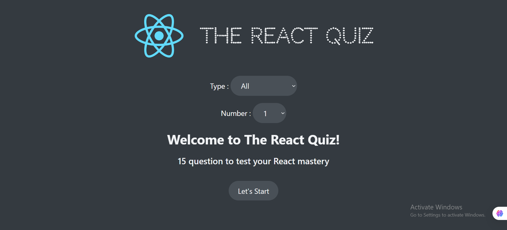
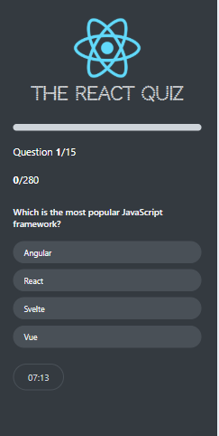

React Quiz App📌
Overview
The React Quiz App is an interactive quiz platform designed for users to test their knowledge of React. Users can select their desired difficulty level and take quizzes tailored to their expertise. The project utilizes React, Context API, and useReducer for efficient state management.

🚀 Features
🎯 Dynamic quizzes with different difficulty levels.

⚡ Efficient state management using useReducer.

🌍 Global state handling via Context API.

📊 JSON-based question storage using json-server.

📝 Interactive user experience with real-time feedback.

🛠 Installation & Setup

To run this React project with json-server, follow these steps:

1. Install dependencies
   First, install the required dependencies by running:

npm install

2. Start the JSON server
   This project uses json-server to serve question data. Run the following command to start the server:

npm run server
This will launch the server on port 8000, reading data from data/questions.json.

3. Start the React app
   After installing dependencies and starting the server, run the following command to start the React application:

npm run start
This will open the app in your browser and run it on port 3000.
 
